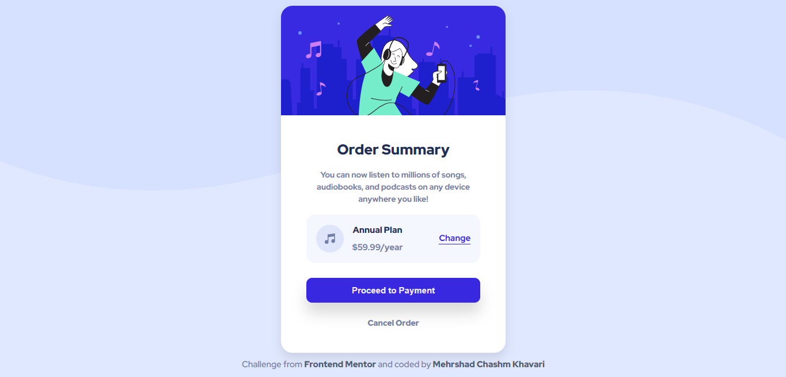

# Order Summary Card Solution

This is a solution to the [Order summary card challenge on Frontend Mentor](https://www.frontendmentor.io/challenges/order-summary-component-QlPmajDUj). I really learned many things and had a lot of fun doing this challenge!

## Table of contents

- [Overview](#overview)
  - [Screenshot](#screenshot)
  - [Links](#links)
- [My process](#my-process)
  - [Built with](#built-with)
  - [What I learned](#what-i-learned)
  - [Continued development](#continued-development)
- [Author](#author)

## Overview

This was one of the most interesting challenges that I have done and that was because of using svg in the background! I already used a real image to fill the background but I haven't used svg to do this. So in this mini project, I used 2 svg to fill the background.

### Screenshot



### Links

- Solution URL: [Add solution URL here](https://your-solution-url.com)

- Live Site URL: [Add live site URL here](https://your-live-site-url.com)

- Twitter: (https://twitter.com/ytmehrshad)

- Github: (https://github.com/MCKH03)

- CodeNewbie: (https://community.codenewbie.org/mckh03)

- dev.to: (https://dev.to/mckh03)

- FrontEnd Mentor Profile: (https://www.frontendmentor.io/profile/MCKH03)

## My process

So I always take some time to build a sketch for myself either in my head or writing it down for bigger projects. I look for places where we need grid and where we need flexbox.

Then, I first only the HTML not doing anything in CSS and I build the HTML with the sketch that I have already designed for myself. Only then I start styling them with CSS and it makes my work a lot faster.

Also in this mini project there was something interesting and that was using svg as background. So I finally figured it out and did the best that I could. All in all it was a great project and I learned a lot building it!

### Built with

- Semantic HTML5 markup
- CSS custom properties
- Flexbox
- CSS Grid
- Desktop-first workflow

### What I learned

So as I said, the main thing that I learned in this project was using svg as background. Also I used flexbox in a lot of different ways. For example the "plan" box is made of 3 flexboxes!

I used svg for background like this and I used after and before pseudo classes:

```html
<h1>Some HTML code I'm proud of</h1>
```

```css
body::after {
  content: url(images/pattern-background-desktop2.svg);
  /* width: 5rem;
  height: 140rem; */
  position: absolute;
  bottom: 0;
  right: 0;
  z-index: -1;
  transform: rotate(180deg) translate(0%, 12%);
}
```

```css
body::before {
  content: url(images/pattern-background-desktop.svg);
  position: absolute;
  top: 0;
  right: 0;
  z-index: -1;
  transform: translate(0%, -12%);
}
```

Also, because I moved the bottom a little bit higher, I needed to set the background color to the bottom svg so that nobody finds out that I have moved the svg up a little bit! It's like this:

```css
body {
  text-align: center;
  font-family: "Red Hat Display", sans-serif;
  position: relative;
  overflow: hidden;
  background-color: #e0e8ff;
  z-index: -2;
}
```

I also used overflow: hidden; for body so that no scrolling happens!

### Continued development

So I guess I still need to work with svg as background I think I know what I am doing at this level!

## Author

- Website - [Mehrshad Chashm Khavari](https://www.your-site.com)

- Frontend Mentor - [@MCKH03](https://www.frontendmentor.io/profile/MCKH03)
